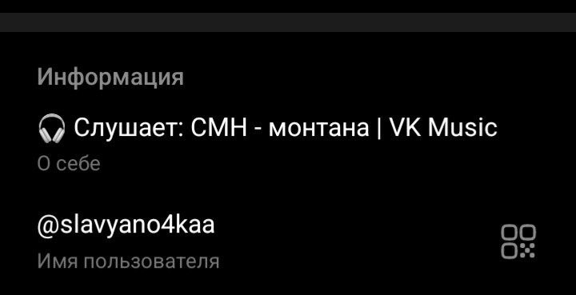
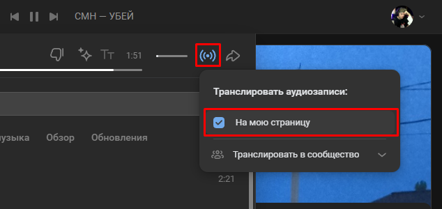
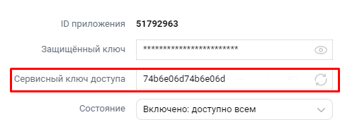
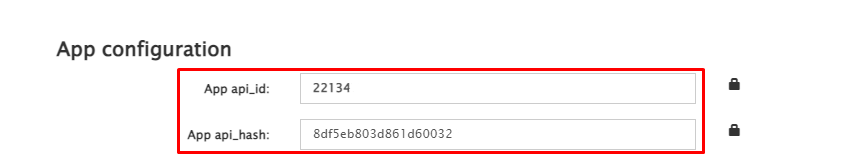

### Трансляция музыки из VK Music в описании профиля Telegram



## Инструкция

### Установка

### Шаг 1:
Клонируем репозиторий с GitHub.
```bash
git clone https://github.com/slavyano4kaa/telegram-vkmusic-status.git
```

### Шаг 2:
Переходим в папку репозитория.
```bash
cd telegram-vkmusic-status
```

### Шаг 3:
Устанавливаем все зависимости из файла `requirements.txt` с помощью пакетного менеджера pip.

```bash
pip install -r requirements.txt
```

### Подготовка

### Шаг 1:
На главной странице VK включите Трансляцию аудиозаписи на страницу  



### Шаг 2:
Создайте приложение на сайте [VK Developers](https://vk.com/apps?act=manage)

### Шаг 3:
В настройках приложения скопируйте сервисный ключ доступа и запишите его где-нибудь

  

### Шаг 4:
Перейдите на страницу [My Telegram](https://my.telegram.org/) и войдите в ваш аккаунт Telegram

### Шаг 5:
Перейдите на API development tools
   **(Если у вас ещё не создано приложение, вам будет предложено его создать.)**
   
### Шаг 6:
В App Configuration скопируйте `App api_id` и `App api_hash`

  

### Шаг 7:
Скопируйте ссылку на вашу страницу в ВК после vk.com (или же ваш ID) и сохраните её

  

### Шаг 8:
Укажите свои данные в переменных `app_token`, `user_id`, `defaultabout`, `api_id` и `api_hash` в файле **main.py**

```python
app_token = 'yourapptoken'
user_id = 'yourvkusername'
defaultabout = 'youraboutme'
api_id = 000000000
api_hash = 'yourapihash'
```

`app_token` – ваш сервисный ключ доступа (шаг 3)

`user_id` – ссылка на вашу страницу ВКонтакте (шаг 7)

`defaultabout` – описание, которое будет отображаться в профиле Telegram если музыка не играет

`api_id` и `api_hash` – App Configuration вашего приложения Telegram (шаг 6)


### Запуск приложения

1. Запустите исполняемый файл
```bash
python main.py
```
2. Выполните вход в Telegram
